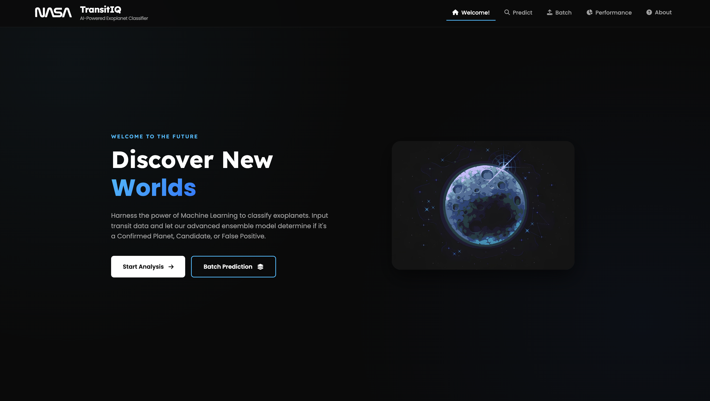
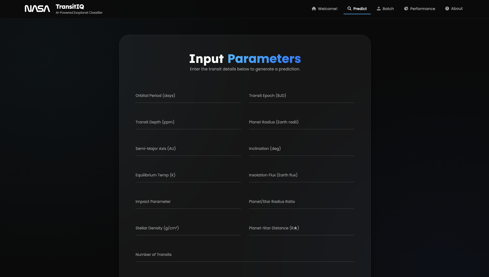
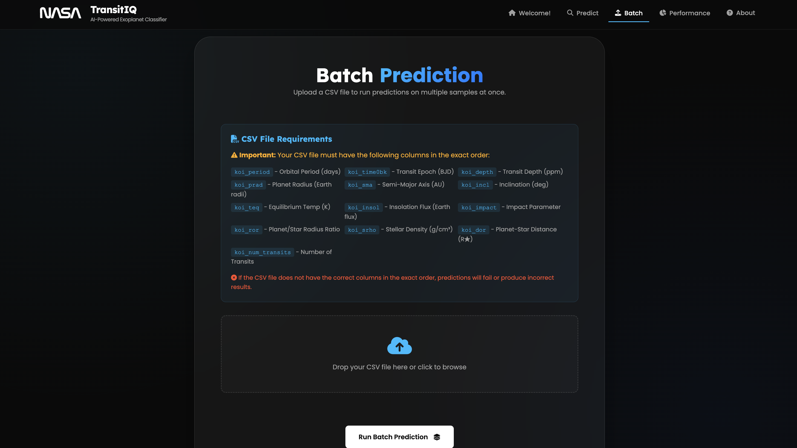
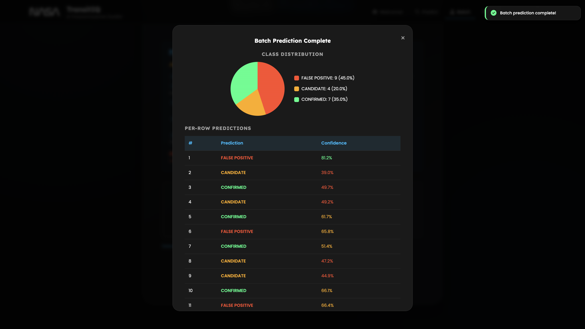

# TransitIQ 🪐

> Welcome to my enhanced fork of **The Exoplanet Classifier** (now renamed to **TransitIQ**). Originally developed with my teammates from **Ontohin 4b** for the **NASA Space Apps Challenge 2025**, this project now represents the upgraded and research-extended version of that submission. To check out the original repository, click [**here**](https://github.com/Ontohin-4b/The_Exoplanet_Classifier).   
> 
> The original repository remains archived under [**Ontohin 4b**](https://github.com/Ontohin-4b) and licensed as such. This fork exists purely for further research, experimentation, and personal development to make the classifier far more powerful and accurate than the hackathon version.

A robust, data-driven Machine Learning tool that classifies transit data into three categories: **Confirmed Exoplanets**, **False Positives**, or **Candidates**.  

This version enhances the original submission with **Staking Ensemble Learning**, robust **Pydantic validation**, and a **FastAPI backend** for high-performance inference. It features extensive preprocessing, imputation, and synthetic oversampling (SMOTE) to ensure a stable and generalizable model.

---

## Table of Contents

- [TransitIQ 🪐](#transitiq-)
  - [Table of Contents](#table-of-contents)
  - [Project Overview](#project-overview)
  - [Screenshots](#screenshots)
  - [Tech Stack](#tech-stack)
  - [Getting Started](#getting-started)
  - [🐳 Docker Deployment](#-docker-deployment)
  - [Core Features](#core-features)
    - [Interactive Web UI](#interactive-web-ui)
    - [Batch Prediction (CSV)](#batch-prediction-csv)
  - [Project Structure](#project-structure)
  - [Deployment & CI/CD](#deployment--cicd)
  - [Model Details](#model-details)
    - [Architecture](#architecture)
    - [Preprocessing Pipeline](#preprocessing-pipeline)
    - [Features](#features)
    - [Labels](#labels)
    - [Data Sources](#data-sources)
    - [Training Workflow](#training-workflow)
    - [Evaluation](#evaluation)
    - [Note](#note)
  - [Acknowledgements](#acknowledgements)
  - [Appreciation](#appreciation)

---

## Project Overview

NASA’s exoplanet survey missions (Kepler, K2, and others) have generated thousands of data points using **the transit method** — tracking dips in starlight caused by orbiting planets.  
These datasets contain both **confirmed exoplanets** and **false positives**, and the aim of this project is to build an AI classifier capable of making preliminary predictions on new candidates.

The classifier runs inside a **FastAPI-powered web interface**, allowing anyone — from students to researchers — to enter transit parameters and instantly receive a prediction.  

The goal is to provide a *scientifically meaningful, intuitive, and educational experience* for users interested in exoplanet research.

---

## Screenshots
**Landing Page**

**Input Fields**

**Batch Prediction**

**Output**


  

---

## Tech Stack

- **Python 3.11 or above** – Core programming language  
- **Pandas, NumPy** – Data processing and numerical computation  
- **Scikit-learn** – Pipeline, scaling, imputation, model stacking, metrics  
- **XGBoost** – Gradient boosting-based sub-model for ensemble  
- **Imbalanced-learn (SMOTE)** – Class balancing for improved fairness  
- **FastAPI** – Backend web framework  
- **HTML/CSS/JavaScript (Vanilla)** – Frontend for the interactive web UI  
- **[Marimo Notebook](marimo.io)** – Used as a sandbox (`notebook/research.py`) to experiment with different model architectures, hyperparameters, and feature engineering before finalizing `fit.py`.

---


## Getting Started

### Prerequisites
- **Python 3.11+**
- **Docker** (Optional, for containerized deployment)

### Local Setup

1.  **Clone the repository**
    ```bash
    git clone https://github.com/ByteBard58/TransitIQ
    cd TransitIQ
    ```
  
2. **Setup Virtual Environment**
   ```bash
   python -m venv .venv
   source .venv/bin/activate  # On Windows: .venv\Scripts\activate
   ```

3. **Install Dependencies**
   ```bash
   pip install -r requirements.txt
   ```

4. **Run the Application**
   ```bash
   uvicorn app.app:app --reload
   ```
   > **Note:** On first run, the app will automatically download the required model weights (approx. 200MB) from Hugging Face if they are not found locally.

5. **Access the UI**
   Open [http://localhost:8000](http://localhost:8000) in your browser.

---

## 🐳 Docker Deployment

The application is fully containerized and available on [Docker Hub](https://hub.docker.com/r/bytebard101/exoplanet_classifier). It supports both **ARM64** and **AMD64** architectures.

```bash
# Pull and run the latest image
docker run --rm -p 8000:8000 bytebard101/exoplanet_classifier:latest
```

If port `8000` is already in use, map it to a different port:
```bash
docker run --rm -p 8001:8000 bytebard101/exoplanet_classifier:latest
```

---

## Core Features

### Interactive Web UI
- **Real-time Prediction:** Enter transit parameters manually to get instant classification and probability scores.
- **Educational Tooltips:** Integrated documentation explains the significance of each scientific parameter (Orbital Period, Impact Parameter, etc.).

### Batch Prediction (CSV)
For large-scale analysis, TransitIQ supports batch processing via CSV upload:
1. Navigate to the **Batch Upload** tab in the UI.
2. Upload a `.csv` file containing the required transit features (follow the sample format provided in `/data/sample_generator.py`).
3. Download the results or visualize the distribution of predictions directly in the dashboard.

---

---

## Project Structure

```text
TransitIQ/
├── app/                # FastAPI Application
│   ├── schema/         # Pydantic validation models
│   ├── static/         # Frontend assets (CSS, JS, Images)
│   └── templates/      # HTML entry points
├── data/               # Raw transit datasets and data generators
├── models/             # ML pipelines and HF integration scripts
├── notebook/           # Research sandboxes (Marimo / research.py)
├── tests/              # Pytest suite (API & Schema testing)
├── .github/            # CI/CD Workflows (Docker Hub & Testing)
└── Dockerfile          # Production container configuration
```

---

## Deployment & CI/CD

- **Automated Testing:** Every push to `main` triggers a GitHub Action that runs the `pytest` suite to ensure API stability.
- **Docker Hub Integration:** On successful tests, the application is automatically built for multi-arch support and pushed to Docker Hub.
- **Model Hosting:** Large serialized model files are hosted on **Hugging Face**, ensuring the repository remains lightweight while the application can "self-heal" by downloading missing artifacts at runtime.

---

## Model Details

### Architecture
The upgraded classifier uses a **stacking ensemble** combining multiple base models with a meta-classifier:

- **Base Models:**
  - `RandomForestClassifier`
    - `n_estimators=1000`
    - `max_depth=None`
    - `class_weight="balanced"`
  - `XGBClassifier`
    - `n_estimators=1000`
    - `max_depth=None`
    - `learning_rate=0.5`
- **Meta-classifier:**
  - `LogisticRegression`
    - `solver="saga"`
    - `penalty="l2"`
    - `C=0.1`
    - `class_weight="balanced"`
    - `max_iter=5000`

The stacking classifier uses **5-fold cross-validation** internally and passes original features to the meta-classifier for better learning.

---

### Preprocessing Pipeline
Before feeding data into the model, the following preprocessing steps are applied via a `Pipeline`:

1. **Imputation:** `SimpleImputer(strategy="mean")` to handle missing values.  
2. **Scaling:** `StandardScaler` to normalize features.  
3. **Class Balancing:** `SMOTE` (Synthetic Minority Oversampling Technique) to address class imbalance.  
4. **Model Training:** Stacking ensemble as described above.

---

### Features
The model uses 13 transit and orbital-related features, including:

- Orbital period, transit epoch, transit depth  
- Planetary radius, semi-major axis, inclination  
- Equilibrium temperature, insolation, impact parameter  
- Radius ratios, density ratios, duration ratios  
- Number of observed transits

---

### Labels
Targets are mapped as follows:

- `0` → FALSE POSITIVE or REFUTED  
- `1` → CANDIDATE  
- `2` → CONFIRMED

---

### Data Sources
- [Kepler Objects of Interest (KOI)](https://exoplanetarchive.ipac.caltech.edu/cgi-bin/TblView/nph-tblView?app=ExoTbls&config=cumulative)  
- [K2 Planets and Candidates](https://exoplanetarchive.ipac.caltech.edu/cgi-bin/TblView/nph-tblView?app=ExoTbls&config=k2pandc)

---

### Training Workflow
- Train/test split: **2/3 training, 1/3 testing** with stratification.  
- Pipeline is trained end-to-end in `models/fit.py`.  
- Hyperparameters and model choices were extensively tested in `notebook/research.py`, which served as a sandbox for experimentation and optimization.  
- Final trained pipeline is saved as `models/pipe.pkl`.

---

### Evaluation

Here is the classification report:

| Class | Precision | Recall | F1-score | Support |
|-------|----------|--------|----------|--------|
| 0 (FALSE POSITIVE / REFUTED) | 0.82 | 0.81 | 0.82 | 1718 |
| 1 (CANDIDATE) | 0.56 | 0.55 | 0.56 | 1118 |
| 2 (CONFIRMED) | 0.79 | 0.81 | 0.80 | 1687 |

**Overall Metrics:**

- **Accuracy:** 0.75  
- **Macro Avg:** Precision = 0.72, Recall = 0.72, F1-score = 0.72  
- **Weighted Avg:** Precision = 0.74, Recall = 0.75, F1-score = 0.75  

This demonstrates that the upgraded stacking classifier maintains strong performance on confirmed and false positive classes, with room for improvement on candidate predictions.  
The model balances **accuracy, generalization, and class fairness**, making it reliable for preliminary exoplanet classification tasks.

---

### Note 
Despite extensive experimentation, this represents the current performance ceiling achievable with the available data.  
Numerous optimizations were explored — including hyperparameter tuning, feature scaling, class rebalancing, and ensemble variations — yet further improvements beyond ~0.75 accuracy were not observed.  
This indicates a **data limitation rather than a model limitation**, as the features may not carry additional separable information for higher classification accuracy.  

The research process behind this version involved significant model testing and fine-tuning efforts (see `notebook/research.py`).  
 
**Suggestions and improvements are highly welcome** — contributions or insights from the community could help push the model beyond its present boundary.


---
  
## Acknowledgements

  

  

- NASA Kepler and K2 Mission for providing the training datasets

  

- Scikit-learn, XGBoost, and Imbalanced-learn teams for exceptional libraries

  

- Inspiration from data science projects exploring real-world astrophysics datasets

  

- The scientists who are engaged with exoplanet research. Their problem inspired us to create this project from the ground up

- Ontohin 4b team for the original NASA SAC 2025 version of this project

---  

## Appreciation

Thank you for checking out this upgraded version of The Exoplanet Classifier.
This repository is a personal continuation of a NASA Space Apps Challenge project — rebuilt with the intent to learn, improve, and explore the depths of real-world astrophysics through Machine Learning.

**Have a great day !**
